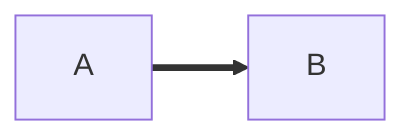
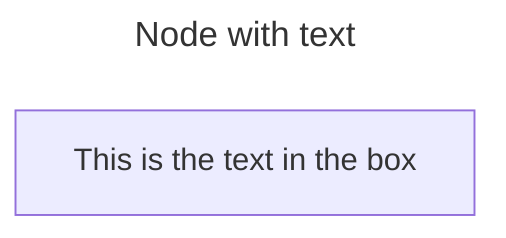

# test page

there is a mermaid chart below


```mermaid
flowchart LR
   A ==> B
```

second chart


```mermaid
---
title: Node with text
---
flowchart LR
    id1[This is the text in the box]
```

```ts
// other code block

```
